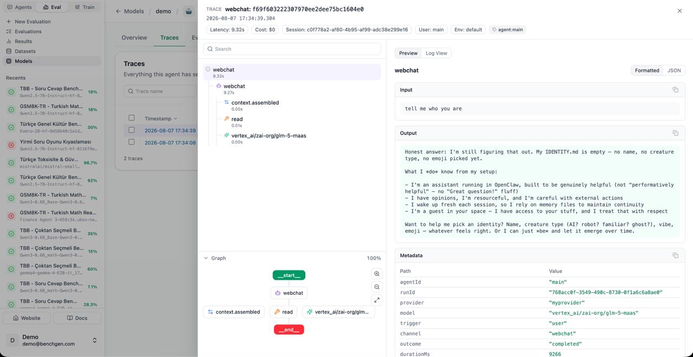

<h1 align="center" style="border-bottom: none">
  <div>
    <a href="https://benchgen.com">
      
    </a>
    <br />
    🔭 OpenClaw Benchgen Observability Plugin
  </div>
</h1>

<p align="center">
  Stream <a href="https://github.com/openclaw/openclaw">OpenClaw</a> agent traces to <br/>
  <a href="https://benchgen.com">Benchgen</a> for observability and training-data capture,<br/>
  and let Benchgen chat with your agent.
</p>

<div align="center">

[](./LICENSE)
[](https://www.npmjs.com/package/@benchgen/benchgen-openclaw)

</div>


## What is new in 0.5.1

- Fix: the context block never reached the prompt. OpenClaw 2026.7.2 registers a
  plugin once per instance in the same gateway process (gateway + pre-warmed agent
  runtime), and `before_prompt_build` fires in the runtime instance, which has no chat
  bridge. The per-session blocks now live in a process-global store (`Symbol.for` key)
  written by the turn runner and read by the hook through `contextForSession`.

## What is new in 0.5.0

- The platform's per-user context block. Benchgen's relay may send `context` with a
  `message` frame (platform agents only): a short text block with the user's name,
  credits and their recent datasets, benchmark runs, training jobs and agents. The
  chat bridge keeps it per session key (`contextOf`) and a `before_prompt_build` hook
  puts it into the system context of that turn as `prependSystemContext`, so it never
  lands in the session history or in the user message the model router routes on.
  Hosts without `api.on` (before 2026.7.2) run without the block. Capped at 8000
  characters; a turn without the field clears the previous block.

## What is new in 0.4.0

Chat turns that arrive through the BenchGen relay now carry the person on the
trace: Langfuse `userId` is the BenchGen account (the relay sends the platform
email as the sender id), `sessionId` is the BenchGen chat, and the display name
sits in the trace metadata as `user_name`. Runs without a person (cron, heartbeat,
CLI) keep the OpenClaw agent id in `userId`, as before. Nothing to configure.

## Why This Plugin

The plugin runs inside the OpenClaw Gateway process. It subscribes to the
diagnostics event stream and turns each conversation turn into one nested trace
(model calls, tool executions, and retrieval steps) grouped by session. Those
traces flow to your Benchgen project, where they can be viewed and exported for
analysis, SFT, and RL fine-tuning.

`@benchgen/benchgen-openclaw` adds native Benchgen tracing for OpenClaw runs:

- LLM request/response spans (with token usage and cost)
- Tool call spans with inputs, outputs, and errors
- Retrieval / search spans
- Run-level metadata, grouped by OpenClaw session

Prompt, response, and tool I/O text are recovered best-effort from the
per-session trajectory transcript, since message content is not delivered over
the public diagnostics bus.

The same plugin also connects the agent to Benchgen for **chat**: Benchgen can
send messages to the agent and receive its replies (streamed), through an
outbound WebSocket the plugin keeps open (works behind NAT) or through a direct
`POST /benchgen/chat` on the gateway. Chat turns are ordinary agent turns, so
they are traced like everything else. See [Chat with Benchgen](#chat-with-benchgen).

If your gateway is remote, install and configure the plugin on that host.

## Install and first run

Prerequisites:

- OpenClaw `>=2026.6.1` for traces; `>=2026.7.2` for chat (the chat bridge needs
  `api.runtime.channel.inbound.dispatch`, which `2026.7.1` does not expose; the
  plugin logs this and keeps streaming traces)
- Node.js `>=22.12.0`

### 1. Install the plugin in OpenClaw

```bash
openclaw plugins install @benchgen/benchgen-openclaw
```

If the Gateway is already running, restart it after install.

### 2. Configure the plugin

```bash
openclaw benchgen configure
```

Paste the agent's **public key** and **secret key** from the Observability card
on its Benchgen page. The wizard verifies the keys against the ingest endpoint,
asks whether Benchgen may chat with the agent (default: yes) and for the chat
relay URL (the card's `BENCHGEN_CHAT_URL`; Enter keeps the built-in default,
which is the production relay), and writes it all into your OpenClaw config, no
manual JSON editing. Restart the gateway to apply.

### 3. Check effective settings

```bash
openclaw benchgen status
```

### 4. Send a test message

```bash
openclaw gateway run
openclaw message send "hello from openclaw"
```

Then confirm traces in your Benchgen project.

## Configuration

### Recommended config shape

```json
{
  "plugins": {
    "entries": {
      "benchgen": {
        "enabled": true,
        "config": {
          "enabled": true,
          "publicKey": "pk-your-public-key",
          "secretKey": "sk-your-secret-key",
          "baseUrl": "https://traces.benchgen.com",
          "chat": {
            "enabled": true,
            "sessionScope": "conversation"
          }
        }
      }
    }
  }
}
```

Chat keys (all optional, under `config.chat`):

| Key | Description | Default |
| --- | --- | --- |
| `enabled` | Chat bridge on/off (relay + gateway endpoint) | `true` |
| `relay` | Keep an outbound WebSocket to Benchgen so it can reach this gateway behind NAT | `true` |
| `url` | Relay WebSocket URL; the agent page's Observability card shows the one for your BenchGen environment (`BENCHGEN_CHAT_URL`); `configure` asks for it | `wss://benchgen.com/api/public/openclaw/chat` |
| `httpEndpoint` | Serve `POST /benchgen/chat` on the gateway port | `true` |
| `sessionScope` | `"conversation"`: one agent session per Benchgen conversation; `"main"`: the agent's main session | `"conversation"` |
| `agentId` | Agent that answers when the message names none | routed/default agent |

### Environment fallbacks

Set these before starting the gateway; they are used as fallbacks when no
config keys are present:

| Variable | Description | Default |
| --- | --- | --- |
| `BENCHGEN_PUBLIC_KEY` | Project public key | none (required) |
| `BENCHGEN_SECRET_KEY` | Project secret key | none (required) |
| `BENCHGEN_BASE_URL` | Ingest endpoint | `https://traces.benchgen.com` |
| `BENCHGEN_CHAT_URL` | Chat relay WebSocket URL | `wss://benchgen.com/api/public/openclaw/chat` |
| `BENCHGEN_CHAT_ENABLED` | `false` turns the chat bridge off | `true` |


Config precedence: `plugins.entries.benchgen.config` → environment variable →
built-in default.

## Event mapping

| OpenClaw event | Benchgen entity | Notes |
| --- | --- | --- |
| `run.started` | trace start | starts the nested run trace for a session |
| `context.assembled` | span | records assembled context for the turn |
| `model.usage` | generation span | writes model output, usage, and cost |
| `model.call.error` | generation span (error) | closes the span with error details |
| `tool.execution.started` | tool/retriever span start | captures tool name + input |
| `tool.execution.completed` | tool/retriever span end | captures output + duration |
| `tool.execution.error` | tool/retriever span end (error) | captures error + duration |
| `tool.execution.blocked` | tool/retriever span end (blocked) | captures blocked reason |
| `run.completed` | trace finalize | closes pending spans and the trace |

## Chat with Benchgen

### What it does

Benchgen sends a message → the plugin runs it as a normal turn of your OpenClaw
agent (same system prompt, tools, session store and permissions as any channel)
→ the reply streams back to Benchgen. Two transports, same behavior:

| Transport | Direction | When to use |
| --- | --- | --- |
| **Relay** (default on) | plugin → Benchgen, outbound WebSocket, kept alive with reconnect + pings | Always works: the gateway connects out, so it can sit behind NAT / docker / a firewall. |
| **HTTP endpoint** (default on) | Benchgen → gateway, `POST /benchgen/chat` on the gateway port | When Benchgen can reach the gateway directly; also handy for local testing with `curl`. |

Chat turns run under channel `benchgen`. With `sessionScope: "conversation"`
each Benchgen conversation gets its own agent session,
`agent:<agentId>:benchgen:direct:<conversationId>`, so parallel chats never
share context and every turn is traced with that session key and the tag
`benchgen-chat`; Benchgen matches a chat to its trace by session key.

The keys that authorize trace ingest are also what authorize chat: the plugin
authenticates to the relay with `Authorization: Basic base64(publicKey:secretKey)`,
and the HTTP endpoint accepts the same header (or `Bearer <secretKey>`). Anyone
holding the project keys can talk to the agent; set `chat.enabled: false` if
that is not wanted.

### Quick check with curl (HTTP endpoint)

```bash
curl -sS http://127.0.0.1:18789/benchgen/chat \
  -u "pk-your-public-key:sk-your-secret-key" \
  -H 'Content-Type: application/json' \
  -d '{"conversationId":"demo-1","text":"hello from benchgen"}'
```

```json
{
  "ok": true,
  "conversationId": "demo-1",
  "messageId": "…",
  "status": "ok",
  "sessionKey": "agent:main:benchgen:direct:demo-1",
  "agentId": "main",
  "text": "Hi! …",
  "replies": [{ "text": "Hi! …", "kind": "final" }]
}
```

Add `-H 'Accept: text/event-stream'` (or `"stream": true` in the body) to get
the reply as it is produced; the SSE events are the frames described below.
`GET /benchgen/chat` (same auth) returns the bridge status, including whether
the relay is currently connected.

### Chat protocol (relay), version 1

The plugin opens `chat.url` with headers `Authorization: Basic …`,
`x-benchgen-plugin: benchgen-openclaw/<version>` and `x-benchgen-protocol: 1`,
and repeats the keys inside the first frame (`hello.auth`); relays that cannot
read upgrade headers authenticate from there; a relay ignores every other frame
until a valid `hello` has arrived. All frames are JSON text; every
plugin→Benchgen frame carries `ts` (epoch ms).

**Plugin → Benchgen**

| `type` | Fields | Meaning |
| --- | --- | --- |
| `hello` | `protocol`, `auth{publicKey,secretKey}`, `plugin{name,version}`, `host{openclawVersion}`, `agents[{id,default}]`, `capabilities[]` | Sent first on every (re)connect; nothing else is sent before it. |
| `turn.started` | `conversationId`, `messageId`, `sessionKey`, `agentId` | The message was accepted and the agent is running. |
| `reply.partial` | `conversationId`, `messageId`, `text`, `delta?`, `replace?` | Streaming: `text` is the reply-in-progress so far. |
| `tool.start` | `conversationId`, `messageId`, `name`, `args?` | The agent started a tool call. |
| `reply` | `conversationId`, `messageId`, `text`, `kind` (`block` \| `final` \| `tool`), `mediaUrls?` | A delivered reply message. A turn may deliver several. |
| `turn.done` | `conversationId`, `messageId`, `status` (`ok` \| `error` \| `dropped`), `error?`, `reason?`, `sessionKey`, `agentId`, `replies{tool,block,final}` | Always the last frame of a turn. |
| `pong` | none | Answer to a `ping`. |

**Benchgen → plugin**

| `type` | Fields | Meaning |
| --- | --- | --- |
| `message` | `conversationId` (recommended), `messageId?`, `text` (required), `sender?{id,name}`, `agentId?`, `timestamp?` | Run one turn. Missing ids are generated and echoed back. |
| `ping` | none | Liveness; the plugin answers `pong`. The plugin also sends WebSocket ping frames itself. |
| `hello.ack` | `protocol`, `agentId` (BenchGen agent id), `chat{connected,disabled}` | Informational answer to `hello`. |
| `chat.status` | `connected`, `skipped?`, `error?` | Informational: whether BenchGen (auto-)connected this agent for chat after the hello. |

The relay closes with `4401` for unknown keys, `4403` for revoked keys, `4408`
when no valid `hello` arrives, and `4409` when a newer socket with the same
keys supersedes this one (the plugin reconnects with backoff in every case).

Unknown frame types are ignored. An invalid `message` gets a `turn.done` with
`status: "error"` and the reason. Turns are serialized per `conversationId` and
run in parallel across conversations. Frames produced while the relay is
disconnected are queued (bounded) and flushed on reconnect.

## How it works

The plugin runs its trace pipeline on a dedicated, isolated OpenTelemetry
provider so it never interferes with OpenClaw's own telemetry. Traces are
buffered and flushed in the background, and an idle reaper closes any
observations orphaned by dropped events. On shutdown, in-flight traces are
flushed before the provider is torn down.

Chat uses the host's public plugin runtime (`api.runtime.channel.inbound.dispatch`
and friends, the same entry point OpenClaw's bundled channels use), so no
OpenClaw core changes are needed and the turn is indistinguishable from one
that arrived over Telegram or WebChat. On hosts whose SDK lacks that surface
the plugin logs which piece is missing and keeps streaming traces.

## Known limitations

No OpenClaw core changes are included in this repository and relies on native
hooks within the OpenClaw ecosystem.

Chat: `benchgen` is not a registered OpenClaw channel plugin: it dispatches
turns through the runtime but has no outbound adapter. So the agent answers
Benchgen inside a turn, but cannot message Benchgen on its own (heartbeats,
cron, the `message` tool), and `openclaw channels status` does not list it.
Slash commands sent from Benchgen run without operator authority.

## License

[MIT](./LICENSE)
